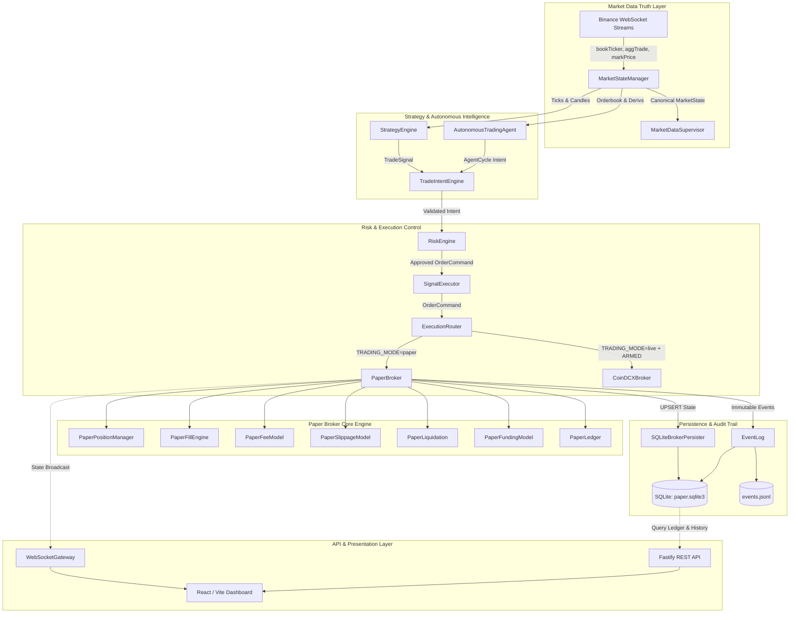

# 01. Architecture & System Topology

**Target System:** `@nemesis-oss/paper-broker`  
**Execution Runtime:** Node.js (TypeScript 5.x) / Fastify / SQLite (`better-sqlite3` WAL) / `decimal.js`  
**Market Data Truth:** Binance WebSocket & REST (`@nemesis-oss/binance-sdk`)  
**Execution Venues:** Simulated Paper Ledger (`PaperBroker`) & Live Exchange (`CoinDCXBroker`) via `ExecutionRouter`  

---

## 1. System Mission & Operating Philosophy

The `paper-broker` is a **production-grade, local-first, event-driven crypto trading simulator and execution gateway**. It fulfills two essential roles:

1. **Deterministic High-Fidelity Paper Broker:** Simulates exchange wallet balances, order matching against real-time Binance orderbook depth, slippage, taker/maker fee drag, continuous mark-to-market settlement, cross-margin liquidation, and 8-hour funding rates.
2. **Unified Execution Gateway:** Implements the [`ExecutionBroker`](file:///home/nemesis/project/trading-workspace/paper-broker/src/broker/types.ts#L428-L437) interface so strategies and autonomous agents trade against simulated paper execution or live exchanges (such as CoinDCX) without modifying a single line of strategy or risk code.

---

## 2. High-Level System Topology



---

## 3. Decoupled Market Data & Execution Venues (ADR 0002)

To maintain realistic market simulation while supporting venue portability, market data and execution venues are strictly decoupled:

* **`signalVenue` (Binance):** Authoritative source of market truth. Normalizes Binance mainnet WebSocket feeds (`bookTicker`, `aggTrade`, `markPrice`, open interest, long/short ratio, taker buy/sell volume) into canonical domain events via [MarketStateManager](file:///home/nemesis/project/trading-workspace/paper-broker/src/market/MarketState.ts).
* **`executionVenue` (Paper / CoinDCX):** Order destination selected at runtime by [ExecutionRouter](file:///home/nemesis/project/trading-workspace/paper-broker/src/execution/ExecutionRouter.ts).
  * `TRADING_MODE=paper`: Orders routed to [PaperBroker](file:///home/nemesis/project/trading-workspace/paper-broker/src/broker/PaperBroker.ts).
  * `TRADING_MODE=live`: Orders routed to [CoinDCXBroker](file:///home/nemesis/project/trading-workspace/paper-broker/src/coindcx/CoinDCXBroker.ts), guarded by [LiveTradingGuard](file:///home/nemesis/project/trading-workspace/paper-broker/src/execution/LiveTradingGuard.ts).

---

## 4. Signal-to-Settlement Execution Pipeline

Every trade follows a strict, one-way pipeline preventing invalid orders from reaching the broker:

```text
Candle Closes / Market Tick
      │
      ▼
Strategy or Autonomous Agent emits TradeSignal
      │
      ▼
TradeIntentEngine (Validates schema, expiry, conflict detection, cooldowns)
      │
      ▼
RiskEngine (Sizes position, validates max leverage, daily loss, notional limits)
      │
      ▼
SignalExecutor (Attaches SL/TP brackets, produces OrderCommand)
      │
      ▼
ExecutionRouter (Selects PaperBroker or Live Exchange)
      │
      ▼
PaperBroker.submitOrder()
      ├─► Validates pre-flight margin
      ├─► Locks required collateral
      ├─► Evaluates BBO liquidity (MAKER vs TAKER)
      ├─► Applies slippage and computes taker/maker fee
      ├─► Executes fill and updates position VWAP
      ├─► Emits Fill to EventLog & updates SQLite via BrokerPersister
      └─► Broadcasts state via WebSocketGateway
      │
      ▼
Continuous Mark-to-Market (onMarket ticks)
      ├─► Recalculates unrealized PnL, equity, and margin ratios
      ├─► Evaluates SL/TP bracket trigger orders
      └─► Checks cross-margin liquidation threshold (Equity <= Maintenance Margin)
      │
      ▼
Position Close / Settlement
      ├─► Realizes PnL (ClosedQty × (Exit - Entry) × Direction)
      ├─► Deducts closing fee
      ├─► Unlocks position margin back to free balance
      └─► Records immutable CLOSE transaction & ledger entries
```

---

## 5. Non-Negotiable Architectural Contracts

In accordance with [CONTRACTS.md](file:///home/nemesis/project/trading-workspace/paper-broker/CONTRACTS.md):

1. **Execution Contract (§1):** Strategy code never submits orders directly to the broker. All submissions pass through `SignalExecutor`.
2. **Broker Ownership Contract (§2):** `PaperBroker` owns all mutations to orders, fills, positions, and account balances.
3. **Market Data Truth Contract (§3):** Fills must price off validated market data (`bid`/`ask`/`last`/`mark`). Stale data halts execution.
4. **Event Log Contract (§4):** The event log (`events` table and `events.jsonl`) is strictly append-only and immutable.
5. **LLM Authority Contract (§5):** LLMs generate market reasoning and intent; deterministic code enforces all risk and execution limits.
6. **Live Execution Safety (§6):** Live mode requires explicit arming (`LIVE_TRADING_ARMED=true`). A live mode error never silently falls back to simulated paper fills.
7. **Monetary Precision Contract (§14):** All money, margin, fee, and PnL calculations must use `decimal.js`.

---

### Next Module
* [**02. Multi-Wallet Architecture & Dual-Currency Accounting**](file:///home/nemesis/project/trading-workspace/paper-broker/docs/paper-broker/02-multi-wallet-and-accounting.md)
