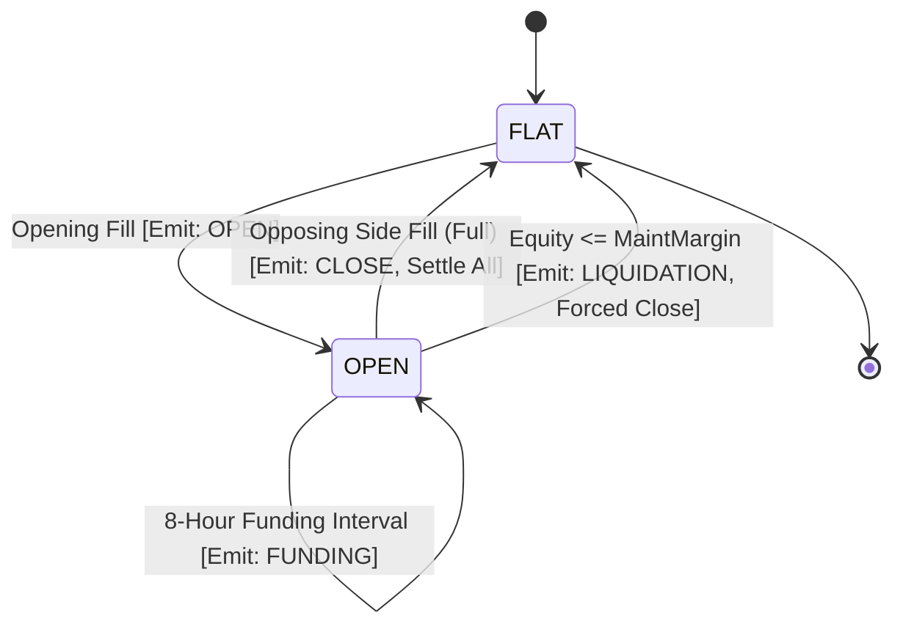

# 03. Double-Entry General Ledger & Lifecycle Events

**Target System:** `@nemesis-oss/paper-broker`  
**Execution Runtime:** Node.js (TypeScript 5.x) / Fastify / SQLite (`better-sqlite3` WAL) / `decimal.js`  

---

## 1. Double-Entry General Ledger (`ledger_entries`)

To guarantee mathematical integrity and enable full financial audits, every monetary movement within `paper-broker` generates balanced double-entry postings in `ledger_entries`.

```text
Chart of Accounts:
  1000 - ASSETS:WALLET:USDT:FREE          (Available trading capital)
  1010 - ASSETS:WALLET:USDT:LOCKED        (Collateral locked in margin/orders)
  2000 - LIABILITIES:MARGIN:INITIAL       (Margin obligations owed)
  3000 - EQUITY:CAPITAL:STARTING          (Initial simulated deposit)
  4000 - REVENUE:TRADING:REALIZED_PNL     (Profits from closed trades)
  5000 - EXPENSE:TRADING:FEES             (Commissions paid to broker)
  5010 - EXPENSE:TRADING:FUNDING          (Funding fees paid/received)
  5020 - EXPENSE:TRADING:REALIZED_LOSS    (Losses from closed trades)
```

### 1.1 Posting Rules & Scenarios

#### Scenario A: Opening a 1 BTC Long Position @ $60,000 (10x Leverage, $6,000 Margin, $24 Fee)
```text
DEBIT   ASSETS:WALLET:USDT:LOCKED        $6,000.00  (Locks collateral)
CREDIT  ASSETS:WALLET:USDT:FREE          $6,000.00
DEBIT   EXPENSE:TRADING:FEES             $   24.00  (Deducts opening taker fee)
CREDIT  ASSETS:WALLET:USDT:FREE          $   24.00
```

#### Scenario B: Position Closes at $61,000 (+$1,000 Profit, $24.40 Closing Fee)
```text
DEBIT   ASSETS:WALLET:USDT:FREE          $6,000.00  (Collateral unlocked)
CREDIT  ASSETS:WALLET:USDT:LOCKED        $6,000.00
DEBIT   ASSETS:WALLET:USDT:FREE          $1,000.00  (Profit credited)
CREDIT  REVENUE:TRADING:REALIZED_PNL     $1,000.00
DEBIT   EXPENSE:TRADING:FEES             $   24.40  (Deducts closing fee)
CREDIT  ASSETS:WALLET:USDT:FREE          $   24.40
```

#### Scenario C: 8-Hour Funding Fee Paid ($6.00 Fee)
```text
DEBIT   EXPENSE:TRADING:FUNDING          $    6.00  (Funding fee expense)
CREDIT  ASSETS:WALLET:USDT:FREE          $    6.00
```

---

## 2. Position Lifecycle State Machine

Each symbol's position transitions through a deterministic state machine:



### 2.1 Position Event Taxonomy (`position_events`)

```typescript
export interface PositionEvent {
  id: string;                      // ULID
  accountId: string;
  symbol: string;
  positionSide: 'LONG' | 'SHORT' | 'BOTH';
  eventType: 
    | 'OPEN'
    | 'INCREASE'
    | 'REDUCE'
    | 'CLOSE'
    | 'FLIP'
    | 'FUNDING'
    | 'MARGIN_CHANGE'
    | 'LIQUIDATION'
    | 'ADL'
    | 'SNAPSHOT';
  fillId?: string;
  orderId?: string;
  qtyBefore: number;
  qtyAfter: number;
  price?: number;
  markPrice?: number;
  realizedPnl?: number;
  fee?: number;
  funding?: number;
  entryPriceBefore?: number;
  entryPriceAfter?: number;
  payload?: Record<string, unknown>;
  createdAtUtc: string;
}
```

---

## 3. Unified UI Transactions Log (`transactions`)

To power the **Futures History & Transactions View** (matching CoinDCX screens), the broker records every user-visible lifecycle event:

```typescript
export interface TransactionRecord {
  id: string;                      // ULID
  accountId: string;
  positionId?: string;
  orderId?: string;
  fillId?: string;
  productType: 'SPOT' | 'FUTURES' | 'OPTIONS' | 'EARN';
  transactionType: 
    | 'DEPOSIT' 
    | 'WITHDRAWAL' 
    | 'INTERNAL_TRANSFER' 
    | 'OPEN_POSITION' 
    | 'CLOSE_POSITION' 
    | 'FUNDING_FEE' 
    | 'COMMISSION' 
    | 'LIQUIDATION';
  currency: string;                // "USDT" | "INR"
  amount: string;                  // Signed decimal string
  fee: string;                     // Commission deducted
  grossPnl?: string;               // Before fees
  netPnl?: string;                 // After fees (grossPnl - fee)
  balanceAfter: string;
  metadata?: Record<string, unknown>;
  timestampUtc: string;
}
```

### 3.1 Example Transaction Rows

| Type | Symbol | Amount | Gross PnL | Fee | Net PnL | Balance After |
| :--- | :--- | :--- | :--- | :--- | :--- | :--- |
| `OPEN_POSITION` | SOLUSDT | $1,400.00 | $0.00 | $0.56 | -$0.56 | $9,999.44 |
| `FUNDING_FEE` | SOLUSDT | -$0.14 | — | — | -$0.14 | $9,999.30 |
| `CLOSE_POSITION`| SOLUSDT | $1,425.00 | +$25.00 | $0.57 | +$24.43 | $10,023.73 |
| `INTERNAL_TRANSFER` | — | -$500.00 | — | $0.00 | -$500.00 | $9,523.73 |

---

## 4. Internal Transfers Between Products

Funds can be seamlessly moved between product wallets (e.g. `Transfer ₹853 from Futures to Spot`):

1. **Transaction Isolation:** Begins an atomic SQLite transaction (`BEGIN IMMEDIATE`).
2. **Pre-Condition Validation:** Asserts `sourceWallet.free >= transferAmount`.
3. **Balance Mutation:**
   $$\text{sourceWallet.free} \leftarrow \text{sourceWallet.free} - \text{amount}$$
   $$\text{destWallet.free} \leftarrow \text{destWallet.free} + \text{amount}$$
4. **Audit Posting:** Emits `INTERNAL_TRANSFER` record and balancing `ledger_entries`.

---

### Navigation
- Previous: [02. Multi-Wallet Architecture & Dual-Currency Accounting](file:///home/nemesis/project/trading-workspace/paper-broker/docs/paper-broker/02-multi-wallet-and-accounting.md)
- Next: [04. Order Management, Reservation & Matching Engine](file:///home/nemesis/project/trading-workspace/paper-broker/docs/paper-broker/04-order-matching-and-execution.md)
